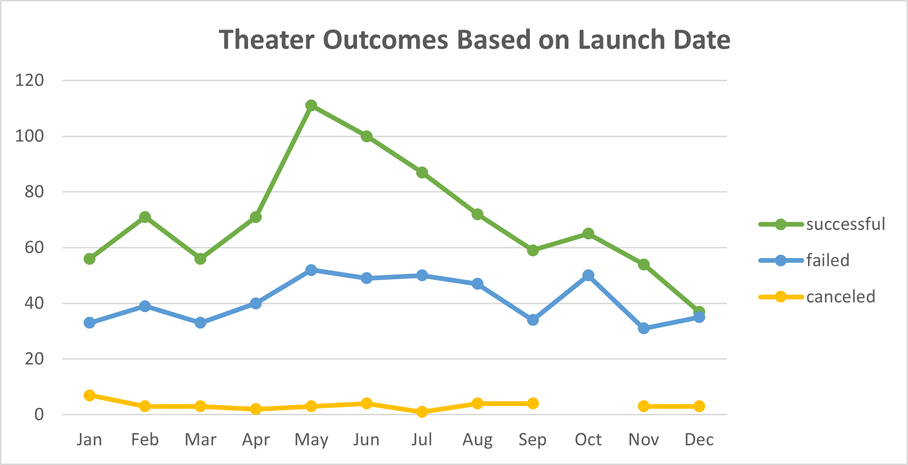
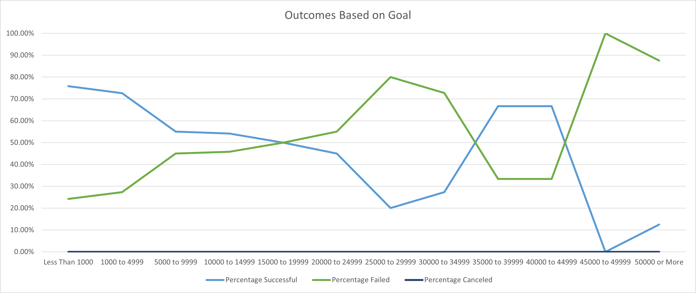

# Kickstarting with Excel

## Overview of Project

### Purpose
Clint Louis wants to see how different play campaigns have resulted based on their launch dates and funding goal amounts. The analysis will help to compare and illustrate the relationship between the launch dates and funding goal amounts through charts.

## Analysis and Challenges

### Analysis of Outcomes Based on Launch Date

    Above graph illustrates that the proporation between successful and failed theater campaigns have generally stayed constant througout the years. There were high numbers of campaigns launched during the months May, June, and July while winter months have had lower number of campaign launches.

### Analysis of Outcomes Based on Goals

    It's rather difficult to draw a clean conclusion based on the chart on how the campaigns have performed depending on the funding goal amounts. The percentage of successful vs failed campaigns have fluctuated throughout the different funding goal ranges. However, if taking $35000 to $44999 funding goals as anomaly, the general tendency shows that the lower the funding goal amount, the higher changes for the campaign to be successful. One can also see that the campaigns with lower funding goals had the highest success rate while campaigns with higher funding goals had lower success rate.

Looking at the count of the projects relative to the successful and failed campaigns for each funding goals, it shows that this graph is not a great chart to determine how to set a funding amount for a campaign. However, it does provide the general trend that play campaigns perform better with lower funding goal amounts.

### Challenges and Difficulties Encountered
There were no challenges in modifying the Excel data and creating charts out of the data. There may have been a difficulty utilizing countifs formula if I wasn't already familiar with it, particularly because it required multiple "if" statements than just one. I think there also may have been a difficulty grouping the pivot tables into months since default on my program was years. I believe it's a bit more difficult to find out that the years were "grouped" and that you can switch into other timelines i.e. months.

## Results

- What are two conclusions you can draw about the Outcomes based on Launch Date?
        
    1. The number of proportion between successful and failed campaigns have generally stayed the same through each month of the year. 
    2. Regardless of the number of campaigns launched for the month, there has been little to no effect on the number of cancelled campaigns, which have stayed very low in number all throughout the months. 

- What can you conclude about the Outcomes based on Goals?

    Theater campaigns will be more successful if they have lower funding goals than higher funding goals. So it will be wise for Louise to set campaign for play *Fever* to have lower funding goal than higher. 

- What are some limitations of this dataset?

    The raw data of the charts encompass play compaigns through the world, which may show different results if launching at a specific country. Also, different campaigns have lasted for different amounts of time, which would contribute to the success rate of the campaign.

- What are some other possible tables and/or graphs that we could create?

    Other possible charts or graphs to consider is a graph illustraing the relation between the funding goal amounts and the campaign duration in days for a successful play. This will aid Louise to choose when she should launch the campaign so that shee has enough time to raise the funds for her possible future play campaigns.
